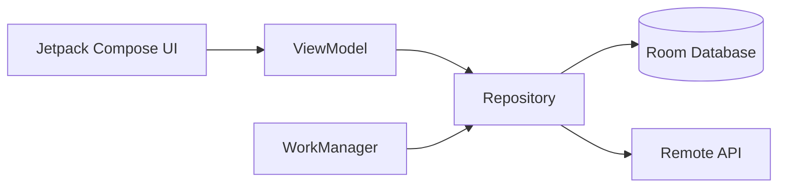
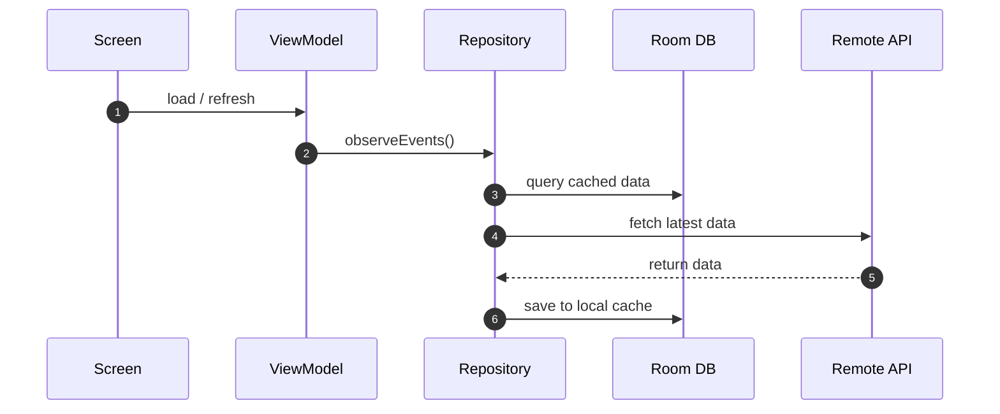

# Events DemoApp

This application allows users to discover nearby events, view detailed event information, calculate distances, navigate using maps, and bookmark events with local persistence and background sync.

## App Demo

<video src="./demo_video.mp4" controls width="100%"></video>

[Download / View Demo Video](./demo_video.mp4)


## Project Overview
This project implements an event explorer feature with the following functionalities:
- **Event List & Discovery**: Displays nearby events fetched from a remote API or cached locally (JSON file, `15 Mins` TTL), with loading and error states.
- **Event Details**: Clicking on an event navigates to a detailed view showing location, time, image, and map navigation.
- **Bookmark Management**: Users can bookmark/unbookmark events, persisted locally via Room database.
- **Background Sync**: Periodic background refresh(`6 Hrs`) using WorkManager and Hilt worker injection (`@HiltWorker`).
- **Error Handling**: Handles network issues, empty event lists, and offline fallback gracefully.

---

## Architecture: MVVM & Clean Architecture
The project follows the **MVVM (Model-View-ViewModel)** architectural pattern combined with Clean Architecture principles.

### Why MVVM?
- **Separation of Concerns**: Clearly divides business logic (ViewModel), data handling and caching (Repository), and UI (Jetpack Compose).
- **State Management**: Works seamlessly with Jetpack Compose and `StateFlow` to implement Unidirectional Data Flow (UDF) via `EventListUiState`.
- **Testability**: Decoupling logic from the Android framework makes unit testing simpler and more effective.

### Data Flow & State Management
- **Data Flow**: Events (e.g., `refresh`, `toggleBookmark`) flow from the UI to the ViewModel. State (e.g., `EventListUiState`) flows from the ViewModel back to the UI.
- **Trade-off Analysis**: In `EventListViewModel`, maintaining a robust `EventListUiState` data class allows the UI to render cached local data instantly from Room while performing background network sync operations. A single screen state object would have coupled UI display with network loading status, potentially degrading user experience on slow connections.


### Architecture Diagram


### Sequence Diagram


---

## Dependency Injection (Dagger Hilt)
- Fully modularized dependency injection using **Dagger Hilt**.
- Provides singletons for Room database, DAOs, Retrofit API clients, Repositories, and scoped instances for ViewModels and WorkManager Workers (`HiltWorkerFactory`).

---

## Engineering Standards & Linting
- **Clean Boundaries**: Strict separation between UI, domain models, and data persistence models (DTO / Entity mapping).
- **State Flow**: Utilizing `StateFlow` and Coroutines for lifecycle-aware state emission.
- **Android Linting**: Code quality is verified using Android Lint (`./gradlew lint`) and Kotlin compiler checks to ensure zero warnings/errors.
- **Offline Resilience**: Local Room caching ensures the app is fully functional offline.

---

## Testing (Unit Tests for Core Logic)
The project includes a comprehensive unit test suite covering ViewModels, domain logic, and utility classes using **JUnit**, **MockK**, and **Coroutines Test**:
- **`DistanceCalculatorTest`**: Verifies distance formatting logic (km logic, exact km).
- **`EventListViewModelTest`**: Verifies reactive state updates, error handling on refresh failures, and bookmark toggling.
- **`EventDetailViewModelTest`**: Verifies event loading and bookmark persistence flows.

### Running Unit Tests & Linting
Run unit tests via Gradle:
```bash
./gradlew testDebugUnitTest
```
Run Android Lint checks:
```bash
./gradlew lint
```

---

## How to Run (Run Steps)
1. **Clone & Open**: Clone the repository and open the project folder in **Android Studio** (newer version).
2. **Gradle Sync**: Click **File > Sync Project with Gradle Files** to download dependencies and build scripts.
3. **Connect Device / Emulator**: Connect an Android emulator or physical Android device.
4. **Run App**: Click the **Run 'app'** button in Android Studio
